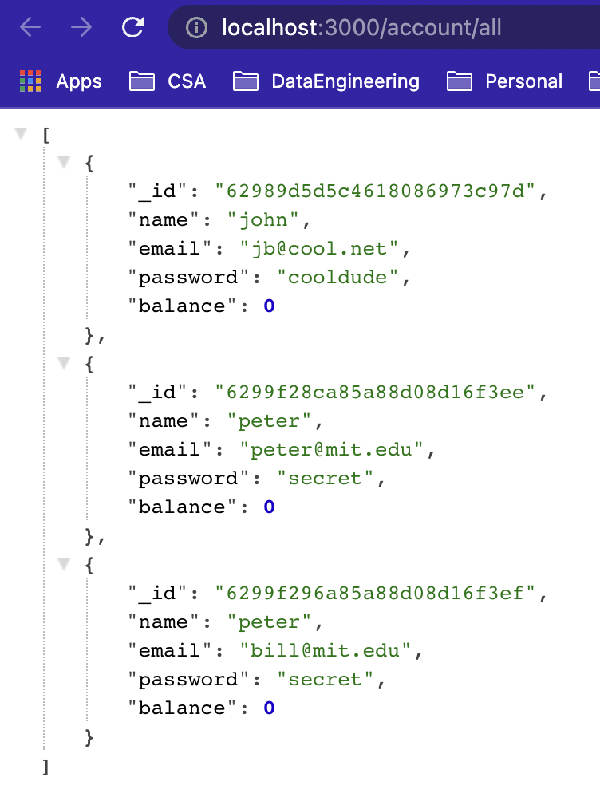

## Project Title: Bad Bank

## Description
Demonstration of a web application using React, Express and Mongo DB.

## Installation Guidelines
### `git clone https://github.com/higgsFriend/BadBankMongoDb`
### `npm install`
### `docker run -p27017:27017 --name badbank -d mongo`
### `node index.js`

## Screenshots

## Technology used:
MERN stack i.e. Mongo DB, Express, React and Node JS

## Features
Simple demonstration of what is possible.  Authentication and Authorization needs to be added in future.

## License
MIT